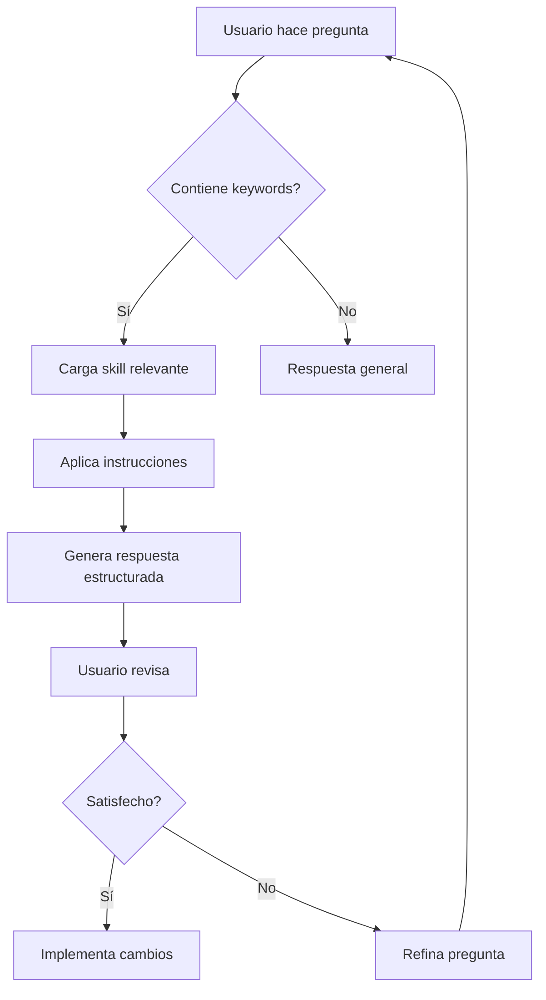

# 🎯 Skills del AsistenteParaLaura

Este directorio contiene las **skills personalizadas** que potencian las capacidades de tu asistente de IA en VS Code.

## 📚 ¿Qué son las Skills?

Las **skills** son capacidades especializadas que el asistente puede usar para tareas específicas. Funcionan como "módulos de conocimiento experto" que se activan automáticamente cuando detectan contexto relevante.

### Diferencia con Comandos Nativos

| Tipo | Ejemplo | Activación | Personalización |
|------|---------|-----------|----------------|
| **Comandos Nativos** | `/explain`, `/fix`, `/tests` | Manual con `/` | No personalizable |
| **Skills Personalizadas** | `revisar-automatizacion` | Automática por keywords | Totalmente personalizable |

---

## 📁 Estructura de Directorio

```
.github/skills/
├── README.md                          ← Este archivo
└── skills/
    ├── SKILL.md                       ← revisar-automatizacion
    ├── documentacion.skill.md         ← (futuro)
    ├── testing.skill.md               ← (futuro)
    └── git-workflow.skill.md          ← (futuro)
```

---

## 🔧 Skills Disponibles

### 1. `revisar-automatizacion`

**Archivo:** [skills/SKILL.md](skills/SKILL.md)

**Descripción:**  
Revisa y mejora scripts de automatización Python con enfoque en Selenium, notificaciones, y sincronización de repositorios.

**Keywords de Activación:**
- `automatización`, `selenium`, `webdriver`
- `revisar código`, `calidad`, `refactorizar`
- `script`, `mejorar`, `optimizar`
- `robustez`, `notificación`, `sync`

**Ejemplos de Uso:**
```
Revisa la calidad del código en carga_horas_simple.py

Analiza el manejo de errores en sync_repositorio.py

Encuentra código duplicado en notificador_cambios.py

Aplica el checklist de Selenium al código seleccionado
```

**Áreas de Análisis:**
- ✅ Estructura y organización del código
- ⚠️ Robustez y manejo de errores
- 🔧 Selenium best practices
- 📊 Mantenibilidad y escalabilidad
- 🐛 Logging y debugging

**Formato de Salida:**
- Puntuación general (X/10)
- Lista de fortalezas
- Problemas priorizados (Alta/Media/Baja)
- Código refactorizado con ejemplos
- Plan de acción con estimaciones

---

## 🚀 Cómo Usar las Skills

### Método 1: Activación Automática (Recomendado)

Simplemente menciona las **keywords** en tu pregunta:

```
Revisa la automatización de carga_horas_simple.py
```

```
¿Cómo puedo mejorar el script de Selenium?
```

```
Analiza la calidad del código en sync_repositorio
```

El asistente detectará automáticamente qué skill usar según el contexto.

---

### Método 2: Activación por Contexto de Archivo

Abre el archivo y pregunta directamente:

```
Revisa este código enfocándote en robustez
```

```
¿Qué mejoras sugieres para este script?
```

```
Aplica best practices de Python a este archivo
```

---

### Método 3: Activación Específica

Menciona explícitamente lo que la skill hace:

```
Aplica el checklist de revisión de automatización
```

```
Usa los criterios de calidad definidos para scripts Python
```

```
Prioriza las mejoras según el estándar establecido
```

---

## 📝 Anatomía de una Skill

Cada skill sigue esta estructura:

```markdown
---
name: nombre-de-la-skill
description: Descripción breve con keywords
---

# Skill: Nombre Descriptivo

## Propósito
Para qué sirve esta skill

## Cuándo Usar Esta Skill
Situaciones específicas

## Palabras Clave
Keywords que activan la skill

## Instrucciones Detalladas
Paso a paso de qué hacer

## Plantillas y Ejemplos
Código de ejemplo

## Criterios de Éxito
Cómo saber si funcionó bien
```

---

## ✨ Crear Nuevas Skills

### Paso 1: Crear el Archivo

Crea un nuevo archivo en `skills/`:

```
.github/skills/skills/mi-nueva-skill.md
```

### Paso 2: Definir la Estructura

```markdown
---
name: mi-nueva-skill
description: Descripción con keywords relevantes
---

# Skill: Mi Nueva Skill

## Propósito
[Explica para qué sirve]

## Cuándo Usar
[Situaciones específicas]

## Palabras Clave
`keyword1`, `keyword2`, `keyword3`

## Instrucciones
[Paso a paso detallado]

## Ejemplos
[Código y casos de uso]
```

### Paso 3: Probar la Skill

Usa las keywords en una pregunta:

```
[Pregunta que incluya las keywords definidas]
```

---

## 🎯 Ideas de Skills Futuras

### `documentacion.skill.md`
**Propósito:** Generar documentación técnica estandarizada  
**Keywords:** `documentar`, `readme`, `docstring`, `api docs`

### `testing.skill.md`
**Propósito:** Crear tests unitarios e integración  
**Keywords:** `test`, `pytest`, `unittest`, `cobertura`

### `git-workflow.skill.md`
**Propósito:** Ayudar con flujo Git y sincronización  
**Keywords:** `commit`, `push`, `merge`, `sync`, `git`

### `refactoring.skill.md`
**Propósito:** Refactorización sistemática de código  
**Keywords:** `refactor`, `clean code`, `solid`, `patrones`

### `debugging.skill.md`
**Propósito:** Análisis y resolución de bugs  
**Keywords:** `debug`, `error`, `bug`, `problema`, `falla`

---

## 💡 Mejores Prácticas

### ✅ Haz esto:

- **Sé específico** con las keywords
- **Define criterios claros** de calidad
- **Incluye ejemplos** de código
- **Prioriza** las recomendaciones
- **Proporciona plantillas** reutilizables
- **Considera el contexto** empresarial

### ❌ Evita:

- Keywords genéricas que se solapan
- Instrucciones vagas o abstractas
- Skills demasiado amplias
- Falta de ejemplos concretos
- Ignorar el nivel de experiencia del usuario

---

## 🔄 Workflow Típico



---

## 📊 Métricas de Skills

### Skill: revisar-automatizacion

| Métrica | Valor |
|---------|-------|
| **Keywords definidas** | 10+ |
| **Áreas de análisis** | 5 |
| **Plantillas incluidas** | 4 |
| **Ejemplos de uso** | 5+ |
| **Nivel de detalle** | Alto |

---

## 🛠️ Troubleshooting

### La skill no se activa

**Problema:** Tu pregunta no contiene las keywords

**Solución:** Revisa las keywords en el archivo de la skill y úsalas en tu pregunta

---

### La respuesta es muy genérica

**Problema:** Múltiples skills tienen keywords similares

**Solución:** Sé más específico o menciona el nombre de la skill directamente

---

### Necesito más contexto en la respuesta

**Problema:** Las instrucciones de la skill son muy básicas

**Solución:** Edita el archivo de la skill agregando más detalles en las secciones de "Instrucciones Detalladas"

---

## 📖 Recursos Adicionales

### Documentación Relacionada

- [AsistenteParaLaura Agent](./../agents/AsistenteParaLaura.agent.md)
- [README Principal](../../README.md)
- [Mejoras Futuras](../../MEJORAS_FUTURAS.md)

### Skills Nativas de Copilot

- `/explain` - Explica código seleccionado
- `/fix` - Sugiere correcciones
- `/tests` - Genera tests unitarios
- `/new` - Crea nuevos archivos
- `@workspace` - Busca en el workspace

---

## 🤝 Contribuir

### Para agregar una nueva skill:

1. **Crea el archivo** en `skills/`
2. **Sigue la estructura** estándar
3. **Define keywords únicas**
4. **Prueba** con varios escenarios
5. **Documenta** en este README

### Para mejorar una skill existente:

1. **Identifica** el área a mejorar
2. **Edita** el archivo de la skill
3. **Prueba** que funcione correctamente
4. **Actualiza** este README si es necesario

---

## 📅 Historial de Cambios

### 2026-02-18
- ✅ Creado skill `revisar-automatizacion`
- ✅ Documentación inicial de skills
- ✅ Estructura de directorio establecida

---

## 🎓 Ejemplos de Uso Real

### Ejemplo 1: Revisión Completa

**Pregunta:**
```
Revisa la calidad del código en carga_horas_simple.py 
enfocándote en código duplicado y robustez
```

**Skill Activada:** `revisar-automatizacion`

**Resultado:**
- Análisis completo con puntuación
- Identificación de 93 líneas duplicadas
- Sugerencias de refactorización
- Plan de acción priorizado

---

### Ejemplo 2: Área Específica

**Pregunta:**
```
¿Cómo puedo mejorar el manejo de excepciones en sync_repositorio.py?
```

**Skill Activada:** `revisar-automatizacion`

**Resultado:**
- Análisis enfocado en manejo de errores
- Plantillas de excepciones específicas
- Ejemplos de refactorización
- Best practices de logging

---

### Ejemplo 3: Checklist Rápido

**Pregunta:**
```
Aplica el checklist de Selenium al código seleccionado
```

**Skill Activada:** `revisar-automatizacion`

**Resultado:**
- Verificación de esperas explícitas
- Revisión de selectores
- Validación de cleanup
- Sugerencias de mejora inmediatas

---

## 📞 Soporte

Si tienes dudas sobre cómo usar las skills:

1. Revisa este README
2. Consulta el archivo de la skill específica
3. Prueba con ejemplos simples
4. Refina tu pregunta según los resultados

---

## 🎉 Conclusión

Las skills personalizadas transforman a tu asistente en un experto especializado en tus necesidades específicas. A medida que agregues más skills, tu AsistenteParaLaura se volverá cada vez más poderoso y útil para tu trabajo diario.

**¡Comienza a usar las skills ahora mismo!**

```
Revisa el código en carga_horas_simple.py
```

---

**Última actualización:** 18 de febrero de 2026  
**Versión:** 1.0  
**Maintainer:** Laura Aristegui
